# OilProject

## Konfiguracja w CPLEX Studio

1. Utwórz nowy projekt:  
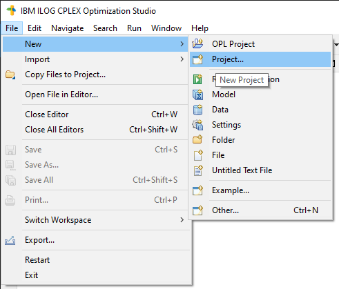
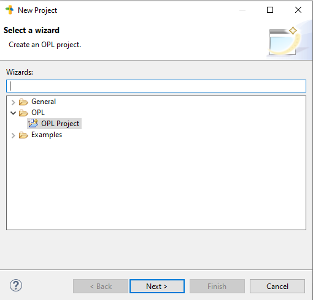 
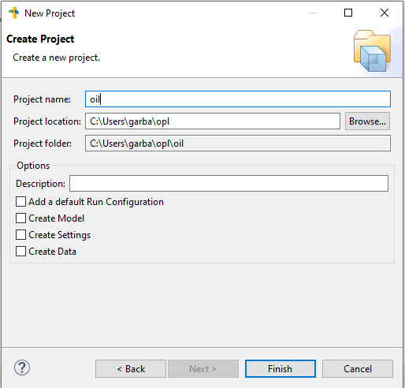
2. Dodaj plik **oil_project.mod** do projektu:  
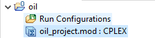
3. Dodaj konfigurację uruchomieniową przeciągając plik **oil_project.mod** na **Run Configurations**:
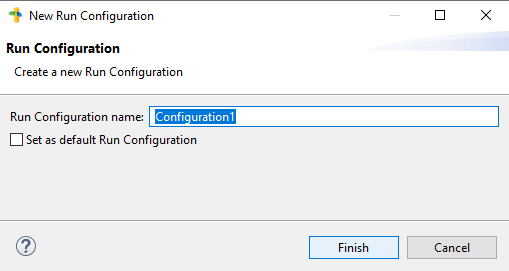
4. Uruchom konfigurację:  
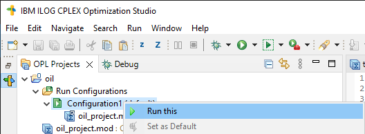

## Konfiguracja w Visual Studio 2022
1. **Utwórz pusty projekt w Visual Studio 2022**
2. **Pobierz całą zawartość https://github.com/MatuszG/OilProject lub pliki oil_project.***
3. **Ustawienia linkera:**
    - Sprawdź czy masz dodane zmienne środowiskowe, jeśli ich nie masz to dodaj je tak jak poniżej z właściwego katalogu odpowiadającego **CPLEX Studio** i jego konkretnej wersji:
    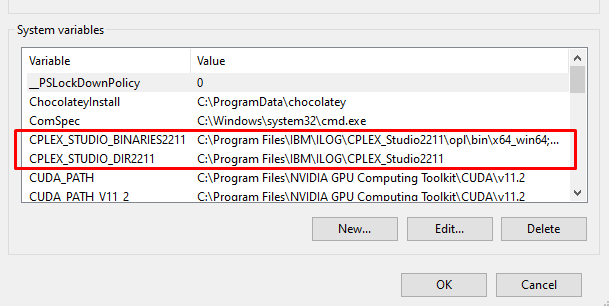  
    zmienna: `CPLEX_STUDIO_BINARIES2211`  
    wartość: `C:\Program Files\IBM\ILOG\CPLEX_Studio2211\opl\bin\x64_win64;C:\Program Files\IBM\ILOG\CPLEX_Studio2211\opl\oplide\;C:\Program Files\IBM\ILOG\CPLEX_Studio2211\cplex\bin\x64_win64;C:\Program Files\IBM\ILOG\CPLEX_Studio2211\cpoptimizer\bin\x64_win64`    
    zmienna: `CPLEX_STUDIO_DIR2211`  
    wartość: `C:\Program Files\IBM\ILOG\CPLEX_Studio2211`
    
    - W ustawieniach Projektu:   
    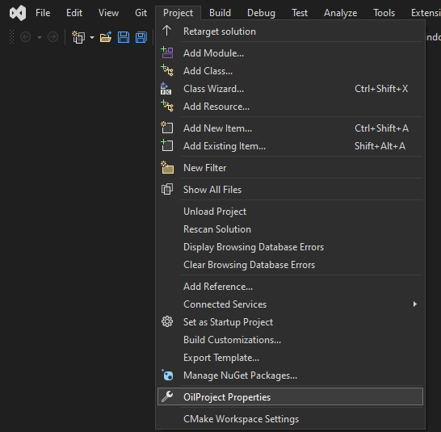
        - ustaw **C/C++** -> **General** -> **Additional Include Directories** = `$(CPLEX_STUDIO_DIR2211)\opl\include;%(AdditionalIncludeDirectories)`:
        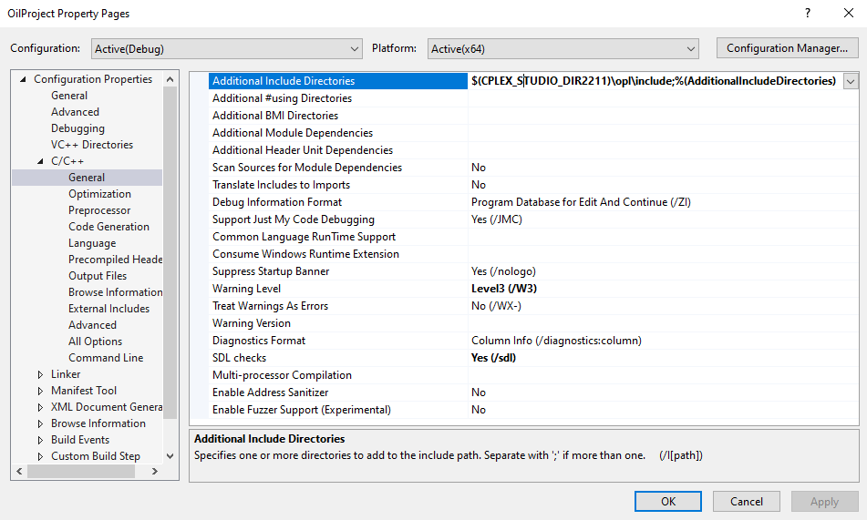
        - ustaw **C/C++** -> **General** -> **Preprocessor** = `WIN64;NDEBUG;_CONSOLE;ILCUSEMT;_CRT_SECURE_NO_DEPRECATE;%(PreprocessorDefinitions)`:
        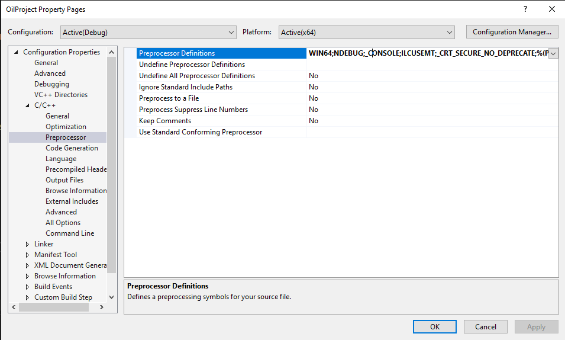
        - upewnij się, że w **C/C++** -> **Code Generation** -> **Runtime Library** = `Multi-threaded DLL (/MD)`:
          
        - ustaw **Linker** -> **General** -> **Additional Library Directories** = `$(CPLEX_STUDIO_DIR2211)\opl\include;%(AdditionalIncludeDirectories)`:
        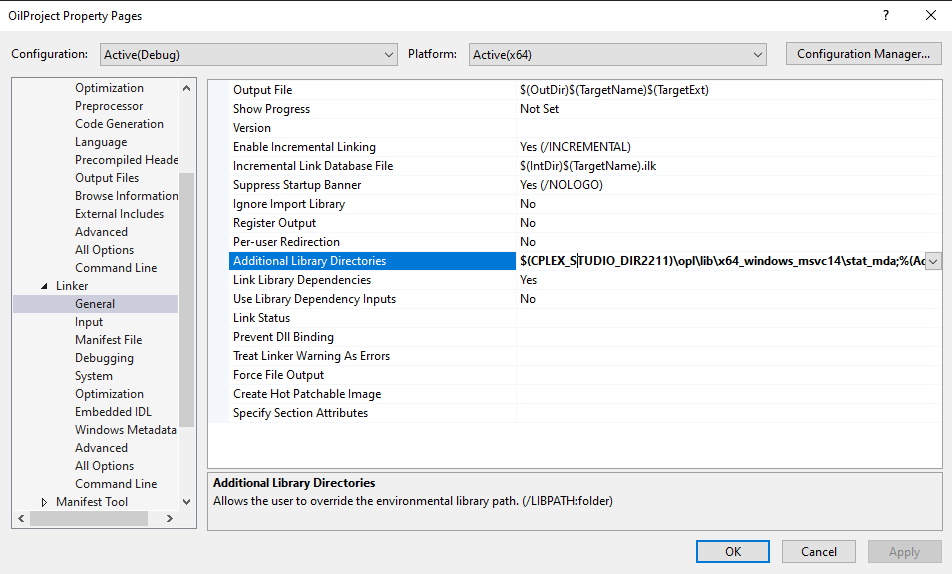
        - ustaw **Linker** -> **Input** -> **Additional Dependencies** = `$(CPLEX_STUDIO_DIR2211)\opl\include;%(AdditionalIncludeDirectories)`:
        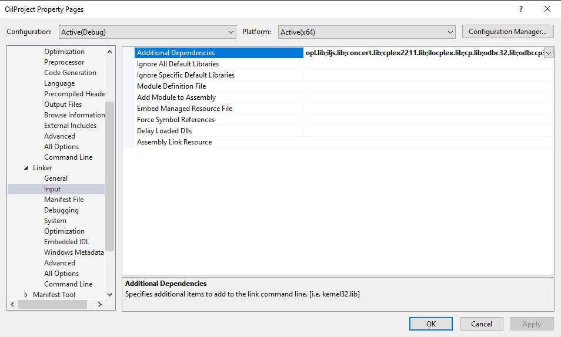
4. Dodaj **oil_project.cpp** do projektu w **Visual Studio 2022**:  
    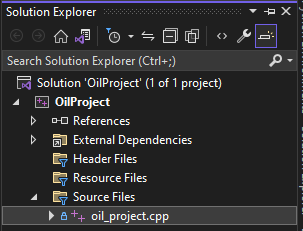
5. Uruchom projekt za pomocą **Local Windows Debugger**:  
    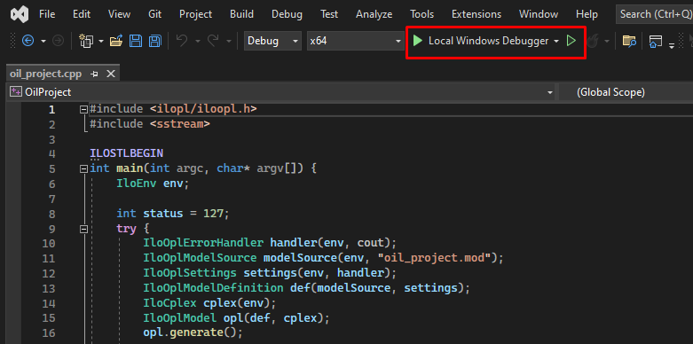